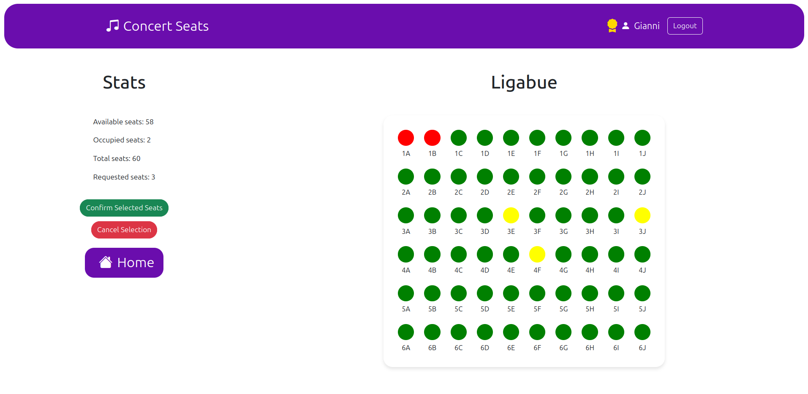

[](https://classroom.github.com/a/XYY1fduM)
# Exam #3: "Concert Seats"
## Student: s332941 Pizzenti Giovanni 

## React Client Application Routes

- Route `/`: Home page, shows the list of all concerts. Logged-in users can also see their reservations status and, if applicable, their loyalty badge. 
- Route `/login`: Login form. After successfull login, it redirects to the main route ("/")
- Route `/details`: Map of seats for a specific concert, accessible by anyone. If logged in, it is possible to make or cancel a reservation
- Route `*`: Page for non-existing URLs (_Not Found_ page) that redirects to the home page

## API Server

- **GET `/api/concerts`**: Retrieve the list of concerts.
  - **Response body**: JSON array of concert objects, each containing concert details.
  ```
  [
  { "ConcertID" : "1",
    "ConcertName" : "Shakira"
    "TheaterID" : "small"
    "AvailableSeats" : "30"
  },
  { "ConcertID" : "2",
    "ConcertName" : "U2"
    "TheaterID" : "small"
    "AvailableSeats" : "30"
  }
  ]
  ```

  - Codes: `200 OK`, `500 Internal Server Error`.

- **GET `/api/reservations`**: Retrieve reservations for a specific user.
  - **Authenticated**.
  - **Response body**: JSON object containing the UserID and an array of concertIDs for which the user has a reservation:
  ```
  { "UserID" : "1",
    "Concerts" : "[ '1', '2' ]"
  }
  ```

  - Codes: `200 OK`, `422 Unprocessable Entity` (validation errors), `500 Internal Server Error`.

- **GET `/api/concerts/:ConcertID`**: Retrieve occupied seats for a specific concert.
  - **Request parameter**: ConcertID:
  ```
    { "1" }
  ```
  - **Response body**: JSON object with the ConcertID and the list of occupied seats for the concert:
  ```
  { "ConcertID" : "1",
    "Seats" : "[ '1A', '1B' ]"
  }
  ```

  - Codes: `200 OK`, `422 Unprocessable Entity` (validation errors), `404 Not Found`, `500 Internal Server Error`.

- **PUT `/api/deleteReservation/`**: Cancel a reservation for a specific user.
  - **Authenticated**.
  - **Request body**: JSON object containing the ConcertID:
  ```
    { "ConcertID": "1" }
  ```
  - **Response body**: JSON object with the information about the result of the cancellation and the list of seatIDs freed:
  ```
    { "success" : "true",
      "message" : "Reservation successfully cancelled and available seats updated",
      "seatsCancelled": "[ '1A', '1B' ]"
    }
  ```

  - Codes: `200 OK`, `422 Unprocessable Entity` (validation errors), `404 Not Found`, `503 Database Error`.

- **PUT `/api/createReservation/`**: Create a reservation for a specific user.
  - **Authenticated**.
  - **Request body**: JSON object containing the ConcertID and an array of seats:
  ```
    { "ConcertID": "1", 
      "seats": ["A1", "A2"] 
    }
  ```
  - **Response body**: JSON object with the information about the result of the reservation and the list of seatIDs occupied:
  ```
    { "success" : "true",
      "message" : "Seats successfully reserved and available seats updated",
      "seatsReserved": 2
      "seatCodes": "[ '1A', '1B' ]"
    }
  ```

  - Codes: `200 OK`, `422 Unprocessable Entity` (validation errors), `404 Not Found`, `503 Database Error`.

- **GET `/api/size/:ConcertID`**: Retrieve the size of the concert based on the theater.
  - **Request parameter**: ConcertID:
  ```
    { "1" }
  ```
  - **Response body**: JSON object with the size of the concert:
  ```
    { "TheaterID" : "1",
      "Rows" : "4",
      "Columns": "8"
    }
  ```

  - Codes: `200 OK`, `422 Unprocessable Entity` (validation errors), `404 Not Found`, `503 Database Error`.

- **GET `/api/stats/:ConcertID`**: Retrieve the stats of the seats for a concert.
  - **Request parameter**: ConcertID:
  ```
    { "1" }
  ```
  - **Response body**: JSON object with the seat statistics for the concert:
  ```
    { "availableSeats": "58",
      "occupiedSeats": "2",
      "totalSeats": "60"    
     }
  ```

  - Codes: `200 OK`, `422 Unprocessable Entity` (validation errors), `404 Not Found`, `503 Database Error`.

- **GET `/api/reservation/:ConcertID`**: Retrieve the list of seats occupied for a specific user in a concert.
  - **Authenticated**.
  - **Request parameter**: ConcertID:
  ```
    { "1" }
  ```
  - **Response body**: JSON object with the array of seats reserved:
  ```
    { 
      "Seats": "[ '1A', '1B' ]"
    }
  ```

  - Codes: `200 OK`, `422 Unprocessable Entity` (validation errors), `404 Not Found`, `503 Database Error`.

- **POST `/api/searchSeats`**: Search for available seats in a concert to use in the first method to make a reservation.
  - **Authenticated**.
  - **Request body**: JSON object containing the ConcertID and the number of seats to search for:
  ```
    { "ConcertID": "1", "numSeats": 2 }
  ```
  - **Response body**: JSON object with the available seats:
  ```
    { "success" : "true",
      "seats": "[ '1A', '1B' ]"
    }
  ```

  - Codes: `200 OK`, `422 Unprocessable Entity` (validation errors), `404 Not Found`, `503 Database Error`.


- **GET `/api/getConcertName/:ConcertID`**: Retrieve the name of the concert
  - **Request parameter**: ConcertID:
  ```
    { "1" }
  ```
  - **Response body**: JSON object with the concert name:
  ```
    { "ConcertName": "Ligabue"}
  ```

  - Codes: - Codes: `200 OK`, `400 Bad Request` (invalid request body), `503 Database error`.

## Authentication APIs

* **POST `/api/sessions`**: Authenticate and login the user.
  - **Request**: JSON object with _username_ equal to name:   
    ```
    { "username": "Gianni", 
      "password": "password" 
    }
    ```
  - **Response body**: JSON object with the user's info and, if the user has a study plan, studyPlan; or a description of the errors:   
    ```
    { "UserId": "1", 
      "Name": "Gianni",
      "Level": Loyal
    }
    ```
  - Codes: `200 OK`, `401 Unauthorized` (incorrect username and/or password), `400 Bad Request` (invalid request body), `500 Internal Server Error`.


* **DELETE `/api/session/current`**: Logout the user.
  - Codes: `200 OK`, `401 Unauthorized`.

* **GET `/api/session/current`**: Get info on the logged in user.
  - Codes: `200 OK`, `401 Unauthorized`, `500 Internal Server Error`.
  - **Response body**: JSON object with the same info as in login:   
    ```
    { "UserId": "1", 
      "Name": "Gianni",
      "Level": Loyal
    }
    ```

## API Server2

* **POST `/api/discount`**: Returns the discount after that a reservation is correctly created:
  - **Response body**: JSON object with the discount computed.   
  ```
    { "discount": "17"}
  ```
 - Codes: `200 OK`, `401 Unauthorized`, `500 Internal Server Error`.

## Database Tables

- Table `Users` - contains _autogenerated (UserID)_, _Mame_, _Hash_, _Halt_, _Level_.

  -_Level_ : basic or loyal to compute the discount.
- Table `Theaters` - contains _(TheaterID)_, Rows, Columns.

  -_TheaterID_ : small, medium, large.
- Table `Concerts` - contains (_autogenerated (ConcertID)_), _concertName_, _TheaterID_, _availableSeats_.

- Table `Seats` - contains (_autogenerated (ConcertID)_, _SeatNumber_), _UserID_.

  -_seatNumber_ identify a unique seat for each concert.

  -_UserID_: if null the seat is free otherwise will contain the ID of user who reserved it.


## Main React Components

`AppWithRouter` (in `App.js`): This is the main component of the app, responsible for managing the overall state and routing within the application. It maintains the state of user authentication, concert reservations, and available concerts. It also handles authentication token renewal, error management, and the data fetching process.

`GenericLayout` (in `Layout.jsx`): Defines the structure of the page, with a fixed navbar and placeholders for displaying other sections. It also define a Context to pass props through Outlet.

`DetailedLayout` (in `Layout.jsx`): Manages the page with detailed information about a concert. If the user is logged in is possible to create or delete a reservation.

`ConcertsTable` (in `ConcertList.jsx`): Displays a table of concerts, including the concert name, theater, available seats, and a link to view more details for each concert. If the user is logged in, additional information is shown.

`ConcertMap` (in `ConcertMap.jsx`): Creates a 2D visualization of the concert seating availability. If the user is logged in, it manages the array of requested seats.

`Navigation` (in `Navigation.jsx`): Builds the navbar. If the user is logged in, it also displays their loyalty status.

`LoginForm` (in `Auth.js`): The login form used to log into the app. It is responsible for client-side validation of login credentials, ensuring a valid username and a non-empty password.


## Screenshot

 

## Users Credentials

| username | password | level |
|----------|----------|-------|
| Gianni | password | loyal |
| Marco | password | basic |
| Laura | password | loyal |
| Marta | password | basic |
| Guglielmo | password | loyal |
| Sabrina | password | basic |

